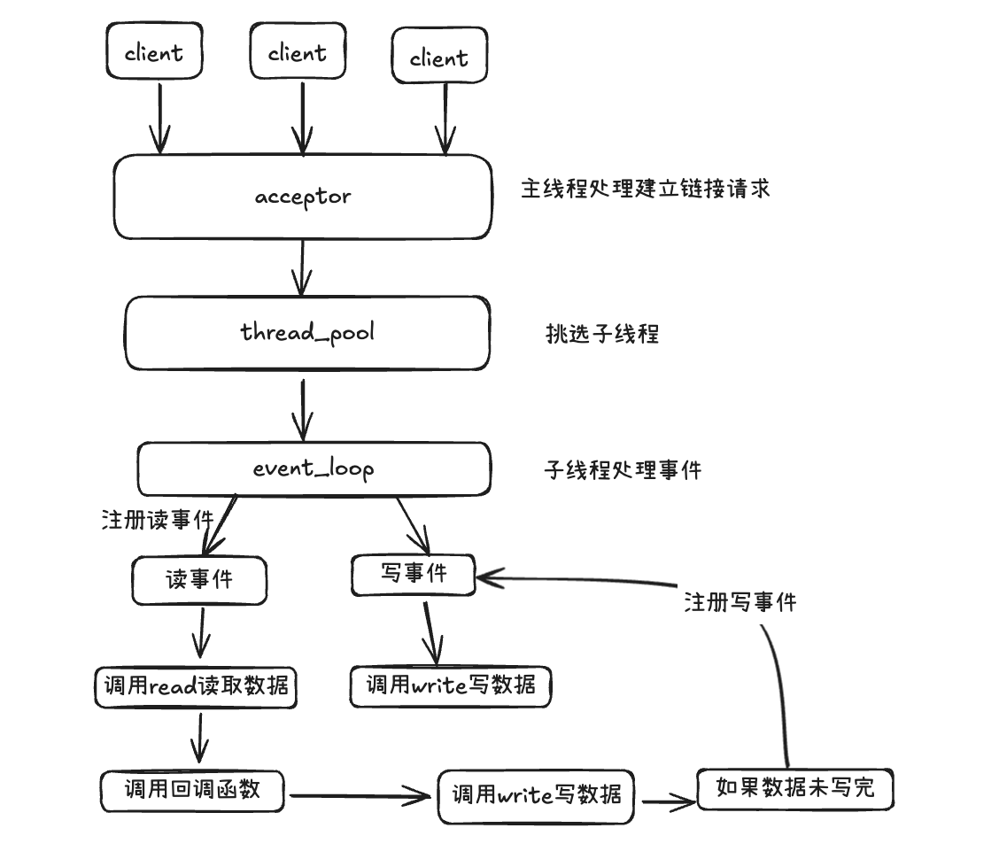

## 0.流程图



## 1. 创建tcp_client

```cpp fold title:test_tcp_client.c
#include "event_loop.h"
#include <stdio.h>

static  char *ip = NULL;
static  char *port = NULL;

void on_read(io_t io, void *buf, int readybytes) {
    printf("recv: %s\n", buf);
}


void on_connect(io_t io) {
    printf("on connect\n");
    io_send_data(io, "hello, world", strlen("hello, world") + 1);
    io_set_readcb(io, on_read);     
    io_read_enable(io);
    return ;
}

void on_close(io_t io) {
    printf("on close\n");
}

void new_connect(event_loop_t loop) {
    io_t io = create_tcp_client(loop, ip, port, on_connect, on_close, NULL);
    if (io == NULL) {
        return -1;
    }
    io_set_readcb(io, on_read);
    io_set_read_timeout(io, 20000);
    io_set_write_timeout(io, 5000);
}

int main(int argc, char *argv[]) {
    if (argc != 3) {
        return -1;
    }
    event_loop_t loop = event_loop_init();
    ip = strdup(argv[1]);
    port = strdup(argv[2]);
    new_connect(loop);

    event_loop_run(loop);
    return 0;
}
```


## 2. 创建tcp_server

```cpp title:test_tcp_server.c 


#include "event_loop.h"
#include <stdio.h>

void on_close(io_t io) {
    printf("on close\n");
}

void on_read(io_t io, char *buf, int readybytes) {
    printf("on read: %s\n", buf);
    const char *str = "hi~~\n";
    io_send_data(io, str, strlen(str)+1);
}

void on_accept(io_t io) {
    printf("on accept\n");
    io_set_readcb(io, on_read);
    io_set_closecb(io, on_close);
}

int main(int argc, char *argv[]) {
    if (argc != 3) {
        printf("usage: %s ip port", argv[0]);
        return -1;
    }
    event_loop_t loop = event_loop_init();
    int thread_num = 4;
    io_t io = create_tcp_server(loop, argv[1], argv[2], on_accept, thread_num);
    event_loop_run(loop);
    return 0;
}


```


## 3. http_client同步请求
```cpp
#include <stdio.h>
#include <unistd.h>
#include "HttpClient.h"

using namespace conn;


void onHttpResponse(const HttpResponsePtr& resp) {
    printf("async resp:%s \n", resp->body.c_str());
    return ;
}

int main(int argc, char *argv[]) {
    
    {
        
        HttpClient client;
        HttpRequest req;
        HttpResponse res;
        req.url = "http://220.181.111.1:80";
        req.method = HTTP_GET;
        req.timeout = 1000000;
        
        int ret = client.send(&req, &res);
        printf("sync resp:%s\n", res.body.c_str());
    }

    return 0;
}
```

## 4. http_client异步请求

```cpp 

#include <stdio.h>
#include <unistd.h>
#include "HttpClient.h"

using namespace conn;


void onHttpResponse(const HttpResponsePtr& resp) {
    printf("async resp:%s \n", resp->body.c_str());
    return ;
}

int main(int argc, char *argv[]) {
    
    {
        HttpClient client;
        HttpRequest req;
        req.url = "http://127.0.0.1:9988/echo";
        req.method = HTTP_POST;
        req.headers["Content-Type"] = "application/json";
        req.timeout = 1000000;
        req.body = "{\"hello:\":\"world\"}";

        client.async_send(&req, onHttpResponse);
        sleep(5);
    }
    
    return 0;
}

```


## 5.创建http_server
```cpp
#include "HttpServer.h"
#include <stdio.h>
#include <memory>


using namespace conn;

int main(int argc, char *argv[]) {
    if (argc != 2) {
        printf("Usage: %s <http_port> <https_port> \n", argv[0]);
        return 1;
    }

    HttpRouter *router = new HttpRouter();
    router->get("/ping", [](HttpRequest *req, HttpResponse *res) {
        res->headers["Content-Type"] = "text/plain";
        res->headers["Connection"] = "close";
        res->body.append("pong");
    });

    router->post("/echo", [](HttpRequest *req, HttpResponse *res) {
        res->headers["Content-Type"] = "text/plain";
        res->headers["Connection"] = "close";
        res->body.append(req->body.c_str());
    });

    std::shared_ptr<HttpServer> server = std::make_shared<HttpServer>();
    server->registerHttpRouter(router);
    
    // replace with your own cert and key file
    const char *cert_file = "/home/ubuntu/github/libconn/ssl/sslca/server.crt";
    const char *key_file = "/home/ubuntu/github/libconn/ssl/sslca/server.key";
    int thread_num = 4;
    server->run("127.0.0.1", argv[1], argv[2], cert_file, key_file, 4);
    return 0;
}
```


## 6. 创建websocket_client

```cpp
#include "WebSocketClient.h"
#include <unistd.h>
#include <iostream>
#include <sys/time.h>

using namespace conn;

void onopen() {
    std::cout << "ws onopen" << std::endl;
}

void onMessage(const char *msg, int len) {
    std::cout << "ws onMessage: " << msg << std::endl;
}

void onClose() {
    std::cout << "ws onClose" << std::endl;
    //打印关闭时刻
    struct timeval tv;
    gettimeofday(&tv, NULL);
    time_t t = tv.tv_sec * 1000 + tv.tv_usec / 1000;
    std::cout << "close time: " << t << std::endl;
}

int main(int argc, char *argv[]) {
    WebSocketClient *ws = new WebSocketClient();
    std::map<std::string, std::string> headers;
    ws->open("ws://127.0.0.1:9988", headers);
    // use tls
    // ws->open("wss://127.0.0.1:9989", headers);

    ws->onopen = onopen;
    ws->onmessage = onMessage;
    ws->onclose = onClose;
    // ws->closeAfterTime(100000);

    
    const char *str = "hello, world";
    while(1) {
        if (str == "exit") {
            ws->close();
            break;
        }
        if (!ws->isConnected()){
            continue;
        } 
        ws->send(str, strlen(str), WS_OPCODE_TEXT);
        sleep(1);
    }

    return 0;
}
```

## 7. 创建websocket_server
```cpp
#include <stdio.h>
#include "WebSocketServer.h"
#include "log.h"

class TestServer {
public:
    TestServer() {
        
    }

    ~TestServer() {
        
    }

    void onConnect() {
        LOG_I("ws server open");
    }

    void onClose() {
        LOG_I("ws client close");
    }

    void onMessage(const char *msg, int len, ws_opcode op_code) {
        // printf("on message: %s\n", msg);
        LOG_I("msg: %s", msg)
    }

};

int main(int argc, char *argv[]) {
    if (argc < 2) {
        printf("Usage: %s <port>\n", argv[0]);
        return -1;
    }

    conn::WebSocketServer ws_server;
    conn::WebSocketService ws_service;
    ws_server.registerWebSocketService(&ws_service);


    ws_service.onopen = [](conn::WebSocketChannel * channel, const conn::HttpRequest * req) {
        TestServer *test_server = new TestServer();
        channel->setWSContext(test_server);
    };

    ws_service.onmessage = [](conn::WebSocketChannel * channel, const char *msg, size_t len, ws_opcode op_code) {
        TestServer *test_server = (TestServer *)channel->getWSContext();
        if (test_server) {
            test_server->onMessage(msg, len, op_code);
        }
        
        channel->send(msg, len, op_code);
    };

    ws_service.onclose = [](const conn::WebSocketChannel * channel) {
        TestServer *test_server = (TestServer *)channel->getWSContext();
        if (test_server) {
            test_server->onClose();
        }
        delete test_server;
    };
    
    // replace with your own cert and key fil
    // const char *cert_file = "/home/ubuntu/github/libconn/ssl/sslca/server.crt";
    // const char *key_file = "/home/ubuntu/github/libconn/ssl/sslca/server.key";
    int thread_num = 1;
    ws_server.run("127.0.0.1", argv[1], NULL, NULL, NULL, thread_num);
    return 0;
}

```


## 8.创建定时器
```cpp
#include "event_loop.h"
#include <sys/time.h>
#include "ctimer.h"

long before_time = 0;
long after_time = 0;

void timer_callback(event_timer_t timer, void *arg) {
    after_time = get_curtime_ms();
    printf("Timer expired, %d\n", after_time - before_time);
    add_timer(timer->loop, 1000, timer_callback, 0);
}

int main(int argc, char **argv) {

    event_loop_t loop = event_loop_init();

    add_timer(loop, 1000, timer_callback, 0);
    before_time = get_curtime_ms();

    event_loop_run(loop);
    return 0;
}
```


